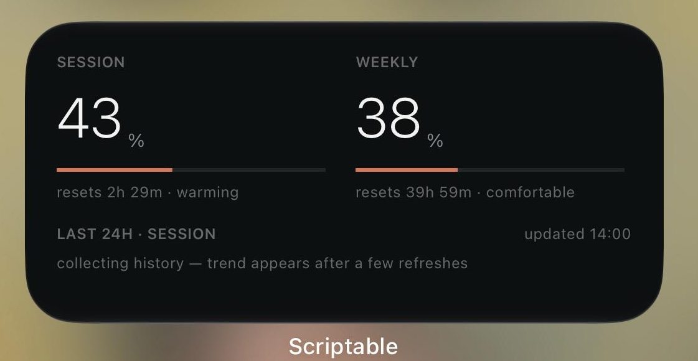

# Claude Usage Widget for Scriptable (iOS)

A polished iOS home-screen and lock-screen widget that shows your [Claude](https://claude.ai) usage — your 5-hour session window, your 7-day weekly limit, Opus usage, and a 24-hour trend sparkline — built with [Scriptable](https://scriptable.app).

It reads the same usage data the Claude website shows, using your own logged-in session cookie. Nothing is sent anywhere except to `claude.ai`.

## Features

- **Session, Weekly & Opus** usage at a glance, color-coded.
- **Reset countdowns** — how long until each window refreshes.
- **Pace labels** — "comfortable", "warming", "critical", etc., projected from how fast you're burning the current window.
- **24-hour trend sparkline** that builds up locally as the widget refreshes.
- Adapts to **small / medium / large** home-screen widgets and **lock-screen** accessories (inline, circular, rectangular).

## Requirements

- An iPhone or iPad with the free **[Scriptable](https://apps.apple.com/app/scriptable/id1405459188)** app installed.
- A **Claude account** (claude.ai).
- A **desktop browser** to grab your session cookie once during setup.

## Setup

### 1. Install Scriptable

Get [Scriptable](https://apps.apple.com/app/scriptable/id1405459188) from the App Store (free).

### 2. Add the script

1. Open Scriptable.
2. Tap the **+** in the top-right to create a new script.
3. Delete the placeholder content, then copy the entire contents of [`claude-usage-widget.js`](claude-usage-widget.js) and paste it in.
4. Tap the script's title at the top and rename it to something like **Claude Usage**.

> Tip: You can also open the raw file on your phone, copy it, and paste it in.

### 3. Get your session key

The widget authenticates as you, using your `claude.ai` session cookie.

1. On a **desktop browser**, log in to [claude.ai](https://claude.ai).
2. Open developer tools:
   - **Chrome / Edge:** `F12` → **Application** tab → **Storage** → **Cookies** → `https://claude.ai`
   - **Firefox:** `F12` → **Storage** tab → **Cookies** → `https://claude.ai`
   - **Safari:** Enable the Develop menu (Settings → Advanced → "Show features for web developers"), then `Develop → Show Web Inspector` → **Storage** → **Cookies**
3. Find the cookie named **`sessionKey`** and copy its **value**. It starts with `sk-ant-sid01-...`.

### 4. Run the script once and paste the key

1. Back in Scriptable, tap the **▶ Play** button to run the script.
2. Choose **Refresh / Preview**.
3. When prompted, paste your `sessionKey` value and tap **Save**.

The key is stored securely in the iOS **Keychain** on your device — it is never written to disk in plain text or sent anywhere other than `claude.ai`.

If everything worked, you'll see a preview of the widget.

### 5. Add the widget to your home screen

1. Long-press an empty area of your home screen → tap **+** (top-left) → search for **Scriptable** → add the size you want (small, medium, or large).
2. Long-press the new widget → **Edit Widget**.
3. Set **Script** to your **Claude Usage** script.
4. (Optional) Set **When Interacting** → **Run Script** so tapping the widget refreshes it in-app.

### 6. (Optional) Add a lock-screen widget

1. Long-press the lock screen → **Customize** → tap the lock screen → tap the widget area.
2. Add a **Scriptable** accessory widget (inline, circular, or rectangular) and select your script.

## Keeping it updated

Sessions expire periodically. When the widget shows an **auth error**:

1. Open the script in Scriptable and tap **▶ Play**.
2. Choose **Reset session key**.
3. Repeat [step 3](#3-get-your-session-key) to grab a fresh `sessionKey` and paste it in.

## How it works

The script calls the same private endpoints the Claude web app uses:

- `GET /api/organizations` — to find your organization id (cached in the Keychain).
- `GET /api/organizations/{org}/usage` — for the usage numbers.

A small rolling 24-hour history (just the percentage points and timestamps) is stored locally in Scriptable's documents folder to draw the trend sparkline. No usage data leaves your device.

## Privacy & security

- Your session key lives only in your device's **Keychain**.
- All network requests go to **`claude.ai`** and nowhere else — read the source, it's a single file.
- This is an **unofficial** tool. It is not affiliated with or endorsed by Anthropic, and it relies on private endpoints that may change at any time.

## Troubleshooting

| Symptom | Fix |
| --- | --- |
| `Blocked (HTML, likely Cloudflare)` | Your session may be invalid or rate-limited. Reset the session key with a fresh cookie. |
| `auth error` / `Bad response` | The `sessionKey` expired. Re-grab it (step 3) and reset it (step in "Keeping it updated"). |
| `No organizations on this account` | Make sure you copied the cookie from an account that has access to Claude chat. |
| Widget shows "collecting history" | The sparkline needs a few refreshes to gather data points — give it some time. |
| Bars don't fill edge-to-edge | The script auto-detects common iPhone widths; unusual devices may be slightly off. |

## Contributing

Issues and pull requests are welcome. This is a single self-contained file — keep it that way if you can.

## License

[MIT](LICENSE)

---

*Unofficial. Not affiliated with Anthropic. "Claude" is a trademark of Anthropic.*
